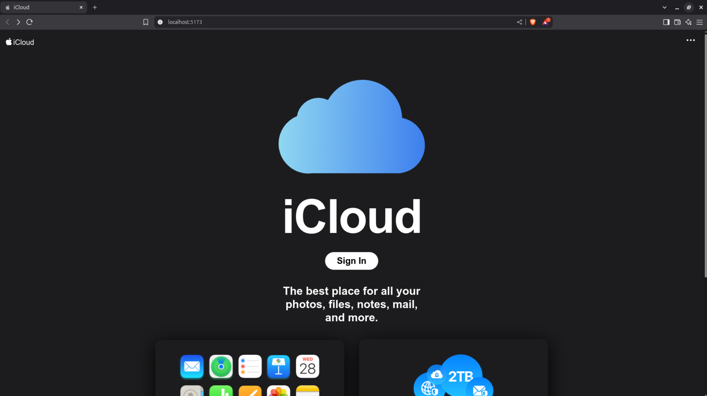
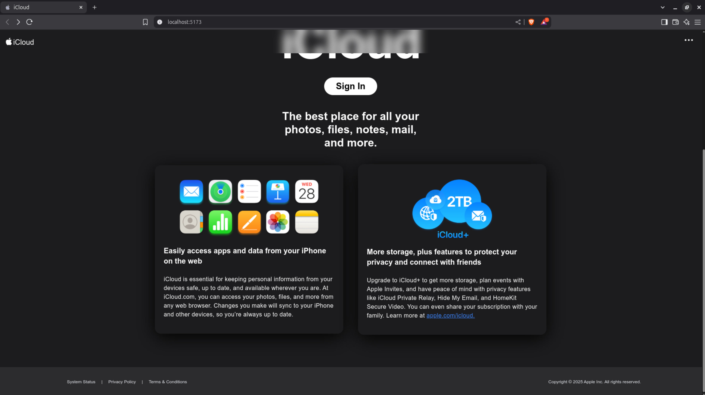
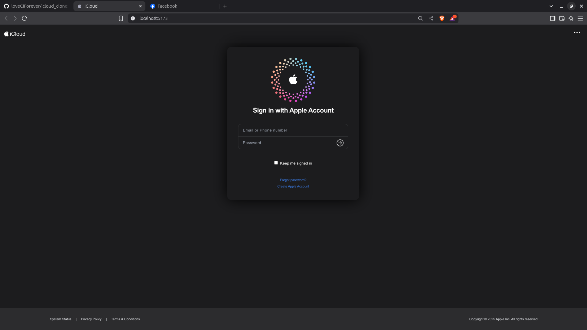

# iCloud Clone

This project is a clone of the iCloud website (icloud.com) created for educational purposes, specifically to demonstrate phishing attacks which is one of my midterm essay requirement (Course: 503073 - Web Programming & Applications)


## Table of Contents

- [iCloud Clone](#icloud-clone)
  - [Table of Contents](#table-of-contents)
  - [Live Demo](#live-demo)
  - [UI Screenshots](#ui-screenshots)
  - [Technologies Used](#technologies-used)
  - [Requirements](#requirements)
  - [Installation](#installation)

## Live Demo
- https://icloud-clone-vippro888.vercel.app/

## UI Screenshots





## Technologies Used

- **React.js**: A JavaScript library for building user interfaces.
- **Tailwind CSS**: A utility-first CSS framework for styling.
- **Vite**: A fast build tool and development server for modern web projects.


## Requirements

To run this project, you will need the following:

- **Node.js**: A JavaScript runtime built on Chrome's V8 JavaScript engine. You can download it from [nodejs.org](https://nodejs.org/).
- **React.js**: A JavaScript library for building user interfaces. This project uses React for the frontend. You can learn more about it at [reactjs.org](https://reactjs.org/).
- **Tailwind CSS**: A utility-first CSS framework for styling your application. You can find more information at [tailwindcss.com](https://tailwindcss.com/).

> Note: This project is designed to work on any operating system (Windows, macOS, Linux).

## Installation

To run this project locally, follow these steps:

1. Clone the repository:
   ```bash
   git clone https://github.com/loveCiForever/icloud_clone.git
   ```
2. Navigate to the project directory:
   ```bash
   cd icloud_clone
   ```
4. Install the dependencies
   ```bash
   npm install
   ```
5. Start the development server
   ```bash
   npm run dev
   ```
7. Open your browser and go to `http://localhost:3000` (or the port specified in the terminal)
